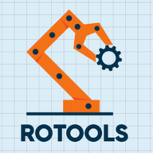
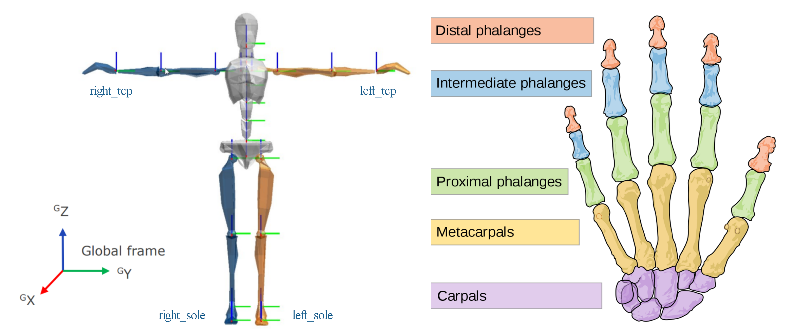

# RoTools



<p align="left">
<a href="https://github.com/DrawZeroPoint/RoTools/actions/workflows/ci.yml"></a>
<a href="https://github.com/psf/black"></a>
</p>

RoTools is an all-in-one ROS package for high-level robotic task scheduling, visual perception, path planning,
simulation, and direct-/tele-manipulation control. It leverages BehaviorTree to deliver fast task construction and
coordination, and provides various utilities to bridge the gap between real/simulated robot and the high level task
scheduler.

# :orange_book: Contents

The packages compose of two components: roport and rotools.

## roport

This module provides the application level entrance ports of the RoTools package. It is a middleware that allows using
rotools cpp/python interfaces in ROS environment. It provides:

### Python based

- [MoveIt Python Server](scripts/roport_moveit_py_server.py) for controlling the robot's single kinematic chain using
  MoveIt's Python interface.
- [Sensing Server](scripts/roport_sensing_server.py) that bridges the perception modules outside the ROS environment
  (like those run in Python3) to ROS via HTTP.
- [Planner Server](scripts/roport_planner_server.py) bridges ROS modules with the planning algorithm outside the ROS
  environment (running in Python3 or on another server on the local network) via HTTP. This server is designed for
  online control, that given the current state, it will query the algorithm for the next state. For now, the states are
  Cartesian poses.
- [Snapshot Server](scripts/roport_snapshot_server.py) enables recording various types of ROS msgs to files.
- [Websocket Client](scripts/roport_websocket_client.py) enables transmitting ROS msgs among two PCs through ROS Bridge.
- [Xsens Server](scripts/roport_xsens_server.py) converting the live stream from Xsens MVN Awinda motion capture suit to
  ROS pose messages.
- [OptiTrack Client](scripts/roport_optitrack_client.py) converting streams from OptiTrack socket server to pose msgs.
- Hardware/Simulation interfaces adapted for a variety types of robots.

### CPP based

- [MoveIt CPP Server](src/roport_moveit_cpp_server.cpp) simultaneously controlling multiple kinematic chains of a robot
  with MoveIt's action interface.
- [Path Planning Interface](src/roport_hpp_interface.cpp) utilizes Humanoid Path Planner to plan whole-body collision
  free paths for high-dof robots.
- [Msg Converter](src/roport_msg_converter.cpp) converts msg from one type to another, be able to modify the name field,
  and enables smoothly start the control of certain joint groups.
- [Task Scheduler](src/roport_task_scheduler.cpp) using behavior tree for task scheduling. A bunch of general purpose
  services and a node [library](tree/palette.xml) are provided for building the task tree fast.

## rotools

This Python package hosted under `src/` is a versatile robotic toolbox aimed for fast prototyping. It includes
foundational modules for robotic problems including path & trajectory planning, kinematics & dynamics calculation,
sensing, transformation calculation, simulation, and so forth.

# :hammer: Prerequisite

## System

Recommended: Ubuntu 20.04 with ROS Noetic, Python 3.8.

This software is continuously built using `catkin_make` and `catkin tools` on Ubuntu 18.04 and 20.04. However, the
support of 18.04 is no longer maintained and will be dropped in the future.

## Supported Robots

This package has been developed as we use the following robots featuring sophisticated design, yet the package itself is
agnostic to robot type and can be used to various types including robot arms and mobile manipulators.

- Walker from UBTech
- [CURI/Curiosity](https://github.com/DrawZeroPoint/curiosity) from CLOVER Lab CUHK

## ROS

The package has been developed targeting the following 2 ROS versions.

### Noetic

```shell script
ROS_DISTRO=noetic

sudo apt-get install ros-$ROS_DISTRO-behaviortree-cpp-v3 ros-$ROS_DISTRO-ros-control ros-$ROS_DISTRO-ros-controllers \
ros-$ROS_DISTRO-webots-ros ros-$ROS_DISTRO-moveit ros-$ROS_DISTRO-std-srvs ros-$ROS_DISTRO-trac-ik-lib \
ros-$ROS_DISTRO-eigen-conversions
```

### Melodic

```shell script
ROS_DISTRO=melodic

sudo apt-get install ros-$ROS_DISTRO-behaviortree-cpp-v3 ros-$ROS_DISTRO-ros-control ros-$ROS_DISTRO-ros-controllers \
ros-$ROS_DISTRO-webots-ros ros-$ROS_DISTRO-moveit ros-$ROS_DISTRO-std-srvs ros-$ROS_DISTRO-trac-ik-kinematics-plugin \
ros-$ROS_DISTRO-eigen-conversions
```

## Python

Run the following command to add `rotools` to your PYTHONPATH:

### If you use Bash

```shell
echo "" >> ~/.bashrc
echo "# RoTools" >> ~/.bashrc
echo "export PYTHONPATH=$HOME/RoTools/src:\$PYTHONPATH" >> ~/.bashrc
```

### If you use Zsh

```shell
echo "" >> ~/.zshrc
echo "# RoTools" >> ~/.zshrc
echo "export PYTHONPATH=$HOME/RoTools/src:\$PYTHONPATH" >> ~/.zshrc
```

### Python Utilities

Optionally, you can install the following Python packages to activate helper utilities.

```shell
sudo pip install playsound pynput requests
```

## Humanoid Path Planner

If the HPP interface is needed, you can install HPP and Pinocchio by:

1. Install [HPP](https://humanoid-path-planner.github.io/hpp-doc/download.html). It is recommended to install with
   binary distributed with `robotpkg`. Here we provide a quick cheatsheet based on the official version:

   <details>
   <summary>Click to expand</summary>

   ```shell
   sudo tee /etc/apt/sources.list.d/robotpkg.list <<EOF
   deb [arch=amd64] http://robotpkg.openrobots.org/packages/debian/pub $(lsb_release -sc) robotpkg
   EOF
   
   curl http://robotpkg.openrobots.org/packages/debian/robotpkg.key | sudo apt-key add -
   
   sudo apt update
   
   apt-cache search robotpkg-
   
   pyver=38  # Default python version in Ubuntu 20.04, change to 36 or 27 if needed
   
   sudo apt-get install robotpkg-py${pyver}-hpp-manipulation-corba robotpkg-py${pyver}-qt5-hpp-gepetto-viewer \
   robotpkg-py${pyver}-hpp-tutorial robotpkg-py${pyver}-qt5-hpp-gui robotpkg-py${pyver}-qt5-hpp-plot \
   robotpkg-py${pyver}-hpp-environments robotpkg-py${pyver}-eigenpy
   ```

   After the installation, add the following to your bashrc (change 3.8 if your version is different):

   ```shell
   echo "" >> ~/.bashrc
   echo "# HPP" >> ~/.bashrc
   echo "export PATH=/opt/openrobots/bin:\$PATH" >> ~/.bashrc
   echo "export LD_LIBRARY_PATH=/opt/openrobots/lib:\$LD_LIBRARY_PATH" >> ~/.bashrc
   echo "export PYTHONPATH=/opt/openrobots/lib/python3.8/site-packages:\$PYTHONPATH" >> ~/.bashrc
   echo "export ROS_PACKAGE_PATH=/opt/openrobots/share:\$ROS_PACKAGE_PATH" >> ~/.bashrc
   echo "export CMAKE_PREFIX_PATH=/opt/openrobots:\$CMAKE_PREFIX_PATH" >> ~/.bashrc
   echo "export PKG_CONFIG_PATH=/opt/openrobots:\$PKG_CONFIG_PATH" >> ~/.bashrc
   ```

   </details>

2. Install Pinocchio [from source](https://stack-of-tasks.github.io/pinocchio/download.html). Note that you need to
   change the default option `BUILD_WITH_COLLISION_SUPPORT` from `OFF` to `ON`. We also provide the command history for
   reference:

   <details>
   <summary>Click to expand</summary>

   ```shell
   cd ~
   git clone --recursive https://github.com/stack-of-tasks/pinocchio
   cd pinocchio/ && git checkout master
   mkdir build && cd build
   cmake -DBUILD_WITH_COLLISION_SUPPORT=ON -DCMAKE_BUILD_TYPE=Release -DCMAKE_INSTALL_PREFIX=/usr/local ..
   make -j4
   sudo make install
   ```

   After building, add the following to your bashrc (change 3.8 if your version is different):

   ```shell
   echo "" >> ~/.bashrc
   echo "# pinocchio" >> ~/.bashrc
   echo "export PATH=/usr/local/bin:\$PATH" >> ~/.bashrc
   echo "export PKG_CONFIG_PATH=/usr/local/lib/pkgconfig:\$PKG_CONFIG_PATH" >>~/.bashrc
   echo "export LD_LIBRARY_PATH=/usr/local/lib:\$LD_LIBRARY_PATH" >>~/.bashrc
   echo "export PYTHONPATH=/usr/local/lib/python3.8/site-packages:\$PYTHONPATH" >>~/.bashrc
   echo "export CMAKE_PREFIX_PATH=/usr/local:\$CMAKE_PREFIX_PATH" >>~/.bashrc
   ```

   </details>

The HPP interface will not be built if `hpp-core`, `hpp-fcl`, and `hpp-manipulation` libraries were not found. You
should have these libs if HPP is properly installed.

## CartesI/O

If tele-operation with CartesI/O is needed, you can install it via:

<details>
<summary>Click to expand</summary>

Install the dependence (for MAT file I/O):

```shell
sudo apt-get install libmatio-dev
```

Go to https://github.com/ADVRHumanoids/XBotControl/releases, download the compressed file from the latest release
according to your system. For 18.04, you should use `bionic`, while for 20.04, use `focal`.

Extract the tar file and inside the folder, run `./install.sh`

Add `source /opt/xbot/setup.sh` into your bashrc, this line should come after sourcing ROS.

</details>

## MuJoCo

If simulation in MuJoCo is needed, you can install necessary software via:

<details>
<summary>Click to expand</summary>

```diff
+ Currently, we have shifted the Python backend for MuJoCo from `mujoco-py` 
+ to the official Python binding `mujoco` >= 2.1.5. 
```

The official version could be easily install by (only support Python 3):

```shell
pip install mujoco
```

This version has the simulator along with it, so you may not need install that independently.

If `mujoco-py` is still preferred, you can follow the instructions at https://github.com/openai/mujoco-py

Some dependencies you may need:

```shell
sudo apt-get install patchelf

pip install numpy --upgrade
```

</details>

## Groot

Groot is a Graphical Editor, written in C++ and Qt, to create BehaviorTrees. The [tree](tree) files should be better
edited using this software.

<details>
<summary>Click to expand</summary>

Follow these steps to install it:

```shell
sudo apt install qtbase5-dev libqt5svg5-dev libzmq3-dev libdw-dev
cd ~ && git clone https://github.com/BehaviorTree/Groot.git && cd Groot
git submodule update --init --recursive
mkdir build; cd build
cmake ..
make
```

Run the script in `Groot/build` to start it:

```shell
~/Groot/build/Groot
```

</details>

# :zap: Install

Clone the repo from GitHub to your $HOME folder:

```shell
cd ~ && git clone https://github.com/DrawZeroPoint/RoTools.git
```

Make a symlink under the ROS workspace (assume `~/catkin_ws` here). Note that the symlink trick enables flexible
multiple ROS workspace support, such that you do not need to manage more than one RoTools package.

```shell
cd ~/RoTools
./make_symlink.sh
```

Then, you can build your ROS packages:

```shell
cd ~/catkin_ws && catkin_make  # We also support catkin build
```

# :running: Use with MoveIt!

The pipeline of using RoTools for a particular robot involves:

Create a description package for the robot you want to use, you can refer to
[curiosity](https://github.com/DrawZeroPoint/curiosity) or walker repo. This may involve:

1. Create a launch file named `<robot>_moveit.launch` for bringing up the MoveIt interfaces, hardware interfaces, and
   optionally a converter for remapping standard measure/control topics to those used by the real/simulated robot.

2. Create a launch file named `<robot>_roport.launch` for bridging RoPort MoveIt server, which essentially is a
   middleware between the MoveIt interface and the task scheduler. It could disassemble various type of movements for
   MoveIt to plan and execute.

3. Arrange the tasks with BT using [Groot](https://github.com/BehaviorTree/Groot). Note that a predefined BT node
   package (palette.xml) has been provided, you can load that into Groot for a quick start. After generating the xml
   file describing the task, feed it as a parameter of the `<robot>_task.launch`.

After finishing these preparations, you can run the demo by

1. Start the simulator or connect to the real robot. Do not forget starting `roscore` when using the simulator.
2. Launch `<robot>_moveit.launch`.
3. Launch `<robot>_roport.launch`.
4. Launch `<robot>_task.launch`.

# :running: Use with CartesI/O

CartesI/O is a whole-body motion planning software developed
in [ADVR, Istituto Italiano di Tecnologia](https://advr.iit.it/). It has not been added to the ROS distribution and
hence install it is needed for proceeding the next steps.

1. Prepare the URDF file and SRDF file of the robot you use.
   [Certain rules](https://advrhumanoids.github.io/CartesianInterface/quickstart.html#setting-up-the-robot-description)
   should be followed.

2. Create a launch file named as `<robot>_cartesio.launch`.

After the preparations, you can

1. launch the file by:
   ```shell
   roslaunch roport <robot>_cartesio.launch
   ```
   This will show a RViz window if you did not set gui:=false. See the explanation of the arguments by launch with
   `--ros-args`.

2. In RViz, right-click the interactive marker (IM) in scene, choose `continous control`, then you can control the robot
   by dragging the IM.

# :running: Use with Xsens Motion Capture

## Launch process

The IMU based motion capture suit provided by [Xsens](https://www.xsens.com/) could be used as a direct tele-operation
input source for controlling the robot. RoTools enables converting the motion capture stream sent via UDP to ROS
messages. To establish the conversion:

1. Configure the MVN Animate/Analyze software, enable transmitting the live stream to the receiving machine's IP
   (the machine running RoTools). The default port number is 9763. You need to get a license for the MVN software to use
   the streaming function.

2. Make sure the publisher and receiver machines are in the same local network. From now on, we assume the receiver's
   network as:

   ```text
   inet 192.168.13.234  netmask 255.255.255.0  broadcast 192.168.13.255
   ```
   While the publisher is:
   ```
   inet 192.168.13.102  netmask 255.255.255.0  broadcast 192.168.13.255
   ```

   The `ufw` of the receiver should be configured to allow incoming access (note 13 is variable while 0/24 is fixed):
   ```shell
   sudo ufw allow from 192.168.13.0/24
   ```

3. Launch the Xsens server
   ```shell
    roslaunch roport roport_xsens.launch
   ```

## Converted topics

By default, the server will publish poses on topics: `/xsens/all_poses`, `/xsens/body_poses`, `/xsens/left_tcp`,
`/xsens/right_tcp`, `/xsens/left_sole`, `/xsens/right_sole`. The former two are in `PoseArray` format, the latter ones
are in `PoseStamped`.
`body_poses` are the poses of body segments without hand segments; `left_tcp` is the left palm pose;
`right_tcp` is the right palm pose. `left_sole` is the left sole pose; `right_sole` is the right sole pose. When
standing in T-pose, the TCP poses and sole poses are illustrated as:



These poses all reference to the reference_frame, which could be 'Pelvis' or 'T8'. You can set the reference frame in
the launch file. If the frame name is not within these two, a given one will be used. If empty string is given, the
default one `world` will be used.

You can use `remap` in the launch file to remap some of these to other topic names.

The server will also publish hand joint states on topics: `/xsens/left_hand_js`, and `/xsens/right_hand_js`. The joint
states for each hand compose of 10 values ranging from 0 to 1, where 0 is fully stretch, 1 is fully bend.

| 1        | 2        | 3        | 4        | 5         | 6         | 7       | 8       | 9        | 10       |
|----------|----------|----------|----------|-----------|-----------|---------|---------|----------|----------|
| thumb_j1 | thumb_j2 | index_j1 | index_j2 | middle_j1 | middle_j2 | ring_j1 | ring_j2 | pinky_j1 | pinky_j2 |

*Note: j1 is the joint between metacarpals (parent) and proximal phalanges (child); j2 is the angle between proximal
phalanges and intermediate/distal phalanges (distal is used only for the thumb). For the four fingers other than the
thumb, the joints between intermediate and distal phalanges are not presented.*

## State switch

For safety concern, you need to activate the conversion by:

Press the `Alt` key (either left or right) on the keyboard. This will switch the status from `deactive` to `active`. To
change back, press `Alt` again. The last output in the console will indicate the current status.

Alternatively, you can use:

```shell script
rosservice call /xsens/enable "data: true"
```

The initial state is in deactivate state, to disable conversion, set `data` as false.

# :running: Use with OptiTrack

## Launch process

First, you should start the server on the Windows side
with [start_server.py](src/rotools/optitrack/windows/start_server.py):

```bash
python start_server.py
```

Then, on the linux side, run:

```bash
roslaunch roport roport_optitrack_client.launch
```

# :page_facing_up: API reference

## roport_robot_interface

This interface inherits the `hardware_interface` in `ros_control`. It gets measured joint states via one or more topics
from the real robot or the simulator. Meanwhile, it sets the joint states commands down to the robot or the simulator
via one or more topics.

To properly use this, you need to set the joint states' getter/setter topics in the launch file like this:

```
  <node pkg="roport" type="roport_robot_interface" name="roport_robot_interface" output="screen">
    <param name="joint_name_param_id" value="/walker/hardware_interface/joints"/>
    <rosparam param="measure_joint_states_id">
      [
      "/walker/leftLimb/joint_states",
      "/walker/rightLimb/joint_states",
      ]
    </rosparam>
    <rosparam param="control_joint_states_id">
      [
      "/walker/leftLimb/command",
      "/walker/rightLimb/command",
      ]
    </rosparam>
    <rosparam param="joint_states_group">
      [
        [
          "left_limb_j1", "left_limb_j2", "left_limb_j3", "left_limb_j4",
          "left_limb_j5", "left_limb_j6", "left_limb_j7"
        ],
        [
          "right_limb_j1", "right_limb_j2", "right_limb_j3", "right_limb_j4",
          "right_limb_j5", "right_limb_j6", "right_limb_j7"
        ]
      ]
    </rosparam>
  </node>>
``` 

The param `measure_joint_states_id` and `control_joint_states_id` must be set. Note that these topic ids have
leading `/`. Besides, the `joint_states_name_group`
should be set for each getter and setter topics. If it is not set, there should be only one getter and one setter topic,
in this case, the algorithm will use all names set in the parameter `joint_name_param_id`.

## roport_msg_converter

This converter will convert `sensor_msgs::JointState` type message from one topic (source) to another (target). Be
different with `remap` which only change the topic's id but not touching the contents, it could:

1. Altering the `name` field. User can specify the names for the joints to care about and define the new names of their
   correspondences in the converted msg.
2. Smooth the start procedure. Usually for control commands, the target configurations are different with the robot's
   current configuration. Directly apply the commands to the robot will cause huge movement not safe to constraints.
   User can specify which group to smooth during start, letting the group slowly reaching the target configurations and
   then follow subsequent commands.
3. Convert joint state message from one type to another, including customized types, and providing arguments to the
   customized ones.

**Note**

1. This converter cannot smooth effort commands which are not changed during smooth.
2. If the smooth has finished, no more smooth will happen unless rerun the program.

To use this function, we need to define the following parameters in the launch file or load them from a yaml file:

| Name                  | Type             | Explanations (the outer lists all with the same length are for joint groups, following we only explain the contents)                                                                       |
|-----------------------|------------------|--------------------------------------------------------------------------------------------------------------------------------------------------------------------------------------------|
| `source_joint_groups` | list[list[str]]  | Joint names defined as a `source_joint_group`. They are adopted for selecting certain names from `source_js_topic`.                                                                        |
| `target_joint_groups` | list[list[str]]  | Joint names having one-on-one correspondence with `source_joint_group`. Target joint values will be under these new names.                                                                 |
| `source_js_topics`    | list[str]        | Topic id `source_js_topic` that should be converted to `target_js_topic`.                                                                                                                  |
| `target_js_topics`    | list[str]        | Topic ids converted from `source_js_topic`.                                                                                                                                                |
| `target_types`        | list[str]        | Target topic type. By default, the type string is `sensor_msgs/JointState`, other types are also supported by modifying the code. Its size must equal to `target_js_topics`.               |
| `target_args`         | list[int]        | Arguments defining the customized control arg. For `sensor_msgs/JointState`, it is ignored. Its size must be equal to target_js_topics.                                                    |
| `enable_smooth_start` | list[int]        | Flag for smooth start. If larger than 0, Ruckig will be used to smoothly move the enabled groups from the current configurations to the target. Its size equals to `source_js_topics`.     |
| `start_ref_topics`    | list[str]        | Topic id for monitoring the robot state and initializing the start configurations for smoothing enabled groups.                                                                            |
| `max_vel`             | map[str, double] | For each joint name, define its maximum allowed velocity during smooth movement. The name could be either in `source_joint_group` or `target_joint_group` (same for max_acc and max_jerk). |
| `max_acc`             | map[str, double] | For each joint name, define its maximum acceleration during smooth movement.                                                                                                               |
| `max_jerk`            | map[str, double] | For each joint name, define its maximum jerk during smooth movement.                                                                                                                       |

## roport_snapshot_server

This server records ROS msgs to local files depending on the msg types. Text types, like JointState, will be saved in
CSV file. Image types are directly saved as images. Currently, we support:

| Type            | Service to call   | Srv                                      |
|-----------------|-------------------|------------------------------------------|
| JointState      | /save_joint_state | [SaveJointState](srv/SaveJointState.srv) |
| Odometry        | /save_odometry    | [SaveOdometry](srv/SaveOdometry.srv)     |
| Pose            | /save_pose        | [SavePose](srv/SavePose.srv)             |
| CompressedImage | /save_image       | [SaveImage](srv/SaveImage.srv)           |

Refer to [roport_snapshot_server.launch](launch/roport_snapshot_server.launch) for launching the function. Topics you
want to take snapshot must be registered with ROS parameters and be published by other nodes. You can specify which
topic to record by calling aforementioned services By default, the saved files are located at `~`.

# :memo: Coding Guide

## The services

### Naming

- The name should obey the CamelCase convention. Each word in the name should avoid meaningless abbreviation, for
  example, Object is better than Obj.

- The first word should only be `Get`, `Sense`, or `Execute`, where `Get` means retrieve some information from within
  the software, such as all names of planning groups, or robot joint states; `Sense` means get information from outside
  environment, such as get the pose of an object; and `Execute` means interact with the environment, such as open a
  switch, move the robot arm, or add a collision object into the planning scene.

- If the second word is `Group`, it means the service operates on a planning group in MoveIt. Similarly, if the word
  is `All`, it means applying to all planning groups. If the context is clear, such as a collision object could only be
  added to a group, the `Group` could be omitted.

- For the third and the following words, `Plan/Plans` means a trajectory, `Pose/Poses` means the 6-DoF Cartesian pose in
  workspace, `JointStates` means the joint values in C-space.

### Content

Add the following comment on top of each .srv file:
Here `[opt]` stands for optional param, whose value could be not given. In this case, note that the default value will
be used.

```
# Brief explanation about the service

# Requests
# param [opt]: Explanation goes here
# ...

# Response
# param [opt]: Explanation goes here
# ...
```

The response of the service should always contain:

```
uint8 SUCCEEDED=0
uint8 FAILED=1
uint8 result_status
```

For these parameters the comment could be omitted.

# :warning: Warning

## Simultaneous execution

The MoveIt Python Server does not support simultaneously execution for multiple end-effectors. To circumvent this, you
can use the MoveIt CPP Server instead.
